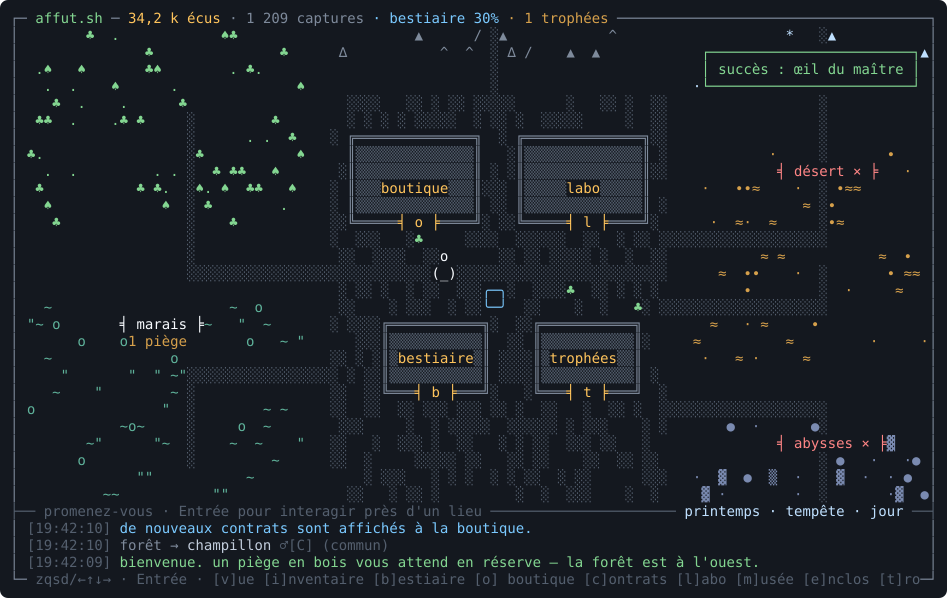
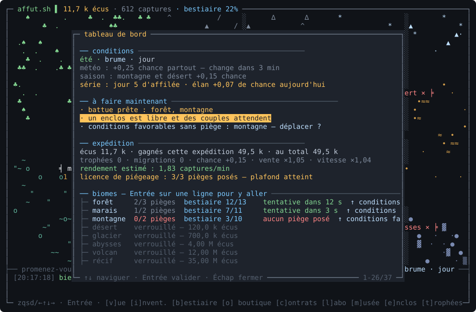
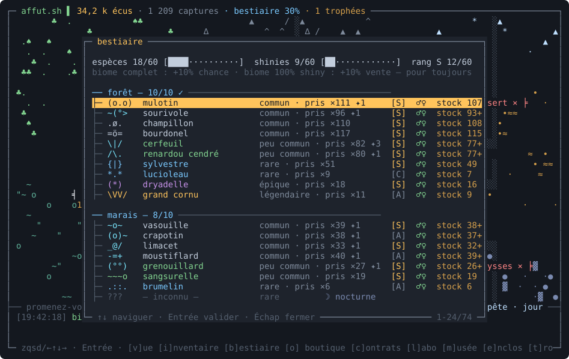
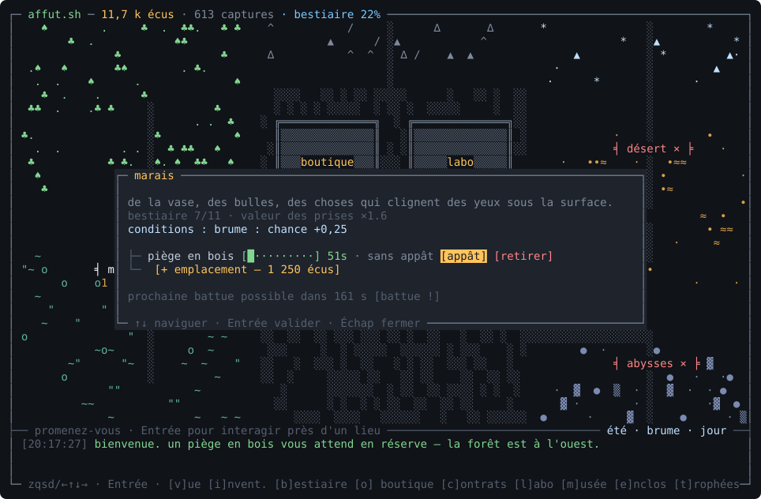

# affut.sh

> un comptoir de capture pour gens patients.

**[▶ jouer dans le navigateur](https://cchopin.github.io/affut.sh/)** — même moteur, même sauvegarde hors-ligne (localStorage).

Jeu **idle de capture et de collection dans le terminal**, écrit en Rust avec
[ratatui](https://ratatui.rs) + crossterm. Posez des pièges dans six biomes,
laissez le temps travailler — même le jeu fermé — et complétez le bestiaire.
Interface inspirée de [late.sh](https://late.sh).



## le jeu

- **Un monde ASCII où l'on se promène** : un village (boutique, labo, bestiaire,
  trophées, musée, enclos) entouré de six biomes — forêt, marais, montagne,
  désert, glacier, abysses.
- **60 espèces à découvrir**, chacune avec sa variante **shiny ✦** (1/128) et un
  **rang** par capture (C, B, A, S — valeur ×1 à ×6). Le bestiaire retient vos
  meilleurs spécimens et les **sexes observés** ♂♀.
- **Idle véritable** : les pièges capturent à intervalle régulier, y compris
  hors-ligne (simulation exacte au retour, plafond extensible au labo).
- **Météo et saisons** : la météo change toutes les 20 minutes (pluie, brume,
  canicule, tempête, nuit étoilée…), chaque jour réel est une saison. Six
  **espèces nocturnes** ☽ ne sortent qu'entre 21 h et 7 h.
- **Économie** : revendez les doublons (les plus bas rangs d'abord — vos beaux
  spécimens et votre meilleur couple ♂♀ sont toujours protégés), financez de
  meilleurs pièges, des appâts, de nouveaux biomes et le labo.
- **Élevage** : à l'enclos, un couple ♂+♀ d'une même espèce donne une naissance,
  parfois d'un rang supérieur, avec shiny ×3.
- **Et aussi** : battues, contrats renouvelés toutes les 2 h, musée à revenu
  passif, légendes errantes ✧ à tenter une seule fois, 26 succès, prestige par
  migration (trophées permanents).

| tableau de bord | bestiaire |
|---|---|
|  |  |



## jouer

```sh
cargo run --release
```

C'est tout. La sauvegarde vit dans `~/.affutsh.json`. Un terminal de 80×24
minimum, truecolor recommandé (repli automatique en 256 couleurs).

**Touches** : flèches ou `zqsd` pour se déplacer, `Entrée` pour interagir,
`?` ouvre le manuel complet en jeu. Raccourcis : `v` tableau de bord,
`i` inventaire, `b` bestiaire, `o` boutique, `c` contrats, `l` labo,
`m` musée, `e` enclos, `t` trophées, `j` journal. `ctrl+c` quitte (et sauvegarde).

## héberger et inviter des amis

Le jeu se sert très bien en SSH, façon late.sh : un conteneur Docker avec un
sshd durci (`ForceCommand` vers le jeu, aucun forwarding, clés invitées
uniquement), **une sauvegarde par joueur** (chaque clé publique est taguée d'un
pseudo via `environment=` dans `authorized_keys`).

```sh
# déployer (docker requis sur le serveur ; le port 2322 sert le jeu)
./deploy/deploy.sh user@mon-serveur

# demander sa clé à un ami (affiche le message à lui envoyer,
# avec la commande pour créer/afficher sa clé publique)
./deploy/invite.sh --demande

# inviter un ami — sa clé, son pseudo, son monde à lui
./deploy/invite.sh alice "ssh-ed25519 AAAA... alice@laptop"

# ajouter un de VOS appareils (même monde, session partagée entre PC)
./deploy/invite.sh --appareil "ssh-ed25519 AAAA... pc-portable"

# lister / révoquer
./deploy/invite.sh --list
./deploy/invite.sh --remove alice
```

`invite.sh` affiche le message prêt à envoyer à l'ami·e, avec l'alias SSH :

```
Host affut
    HostName mon-serveur
    Port 2322
    User affut
```

…et ensuite `ssh affut` suffit pour jouer.

## crédits

L'identité visuelle (palette, cadre, fenêtres, minuscules) est un hommage à
[late.sh](https://late.sh) de mpiorowski — allez-y, c'est bien.
Les 60 créatures, leurs mœurs discutables et leur lore sont originaux.

> le dossier `web/` contient une ancienne variante navigateur (single-file), antérieure aux rangs/météo/élevage — le jeu terminal est la version de référence.
